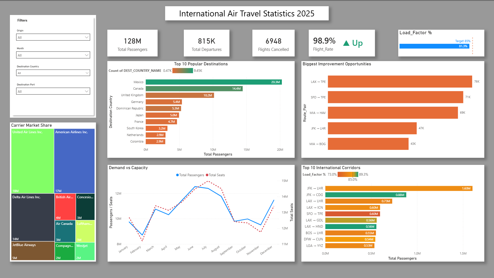

# International Air Travel Statistics 2025 — Power BI Dashboard

An operational efficiency and strategic analysis dashboard built from the U.S. 
Bureau of Transportation Statistics (BTS) T-100 International Segment data. 
The dashboard goes beyond descriptive reporting to surface where airlines 
could improve revenue through better load factor management.

**Operational efficiency**
- How efficiently are airlines filling their planes? (Load Factor: 81.3% vs 85% target)
- How reliably are scheduled flights actually performed? (Flight Rate: 98.9%)
- How does demand compare to capacity month over month?

**Market structure**
- Which carriers dominate international air travel from US airports?
- Which destination countries see the most traffic?
- Which specific routes are the busiest?

**Strategic opportunities**
- Which routes are running below load factor target?
- Where would improving load factor have the biggest revenue impact?

## Key design decisions

### Two parallel fact tables, not one

The data model uses two fact tables sharing common dimensions rather than 
merging them:

- `I92` — all flight activity (scheduled + unscheduled), used for passenger 
  and capacity analysis
- `Flight_Disruptions` — scheduled flights only, used for fulfillment and 
  cancellation analysis

This separation matters because a flight performed without being scheduled 
would inflate fulfillment rate calculations if combined with scheduled-flight 
data. Keeping them separate preserves measurement integrity.

### Opportunity Score as the differentiator

Rather than ranking routes by raw load factor (which would over-prioritize 
small underperforming routes), the dashboard uses a custom Opportunity Score 
that multiplies the load factor gap by passenger volume. This surfaces routes 
where moderate improvements would have the biggest revenue impact.

For example, JFK → LHR runs at ~80% load factor (only 5 points below target), 
but its 1.6M passenger volume means small improvements recover more revenue 
than fixing a smaller route running at 50%. The Opportunity Score visual 
captures this trade-off mathematically.

### Dual-metric corridor visual

The Top 10 Corridors chart encodes two metrics at once:
- **Bar length** = passenger volume (size of the route)
- **Bar color** = load factor (health of the route)

A long red bar reveals a high-volume problem route; a long green bar reveals 
a strategic strength. This is genuinely actionable information that single-metric 
visuals can't communicate.

## Data source

All data was sourced from the U.S. Bureau of Transportation Statistics:

- **Dataset:** T-100 International Segment
- **Period:** Calendar year 2025
- **Coverage:** All international flight segments to/from U.S. airports
- **Source:** [BTS TranStats Database](https://www.transtats.bts.gov/DL_SelectFields.aspx?gnoyr_VQ=FJE&QO_fu146_anzr=Nv4+Pn44vr45)

- ## Insights surfaced

A few non-obvious findings from the dashboard:

- **JFK → LHR is the largest international route (1.6M passengers) but isn't 
  the healthiest** — running below target at ~80% load factor. The sheer 
  volume makes it the highest-priority improvement opportunity despite a 
  modest load factor gap.

- **Transpacific routes underperform.** Routes to Taipei (LAX → TPE, SFO → TPE) 
  appear consistently in the bottom of the load factor distribution.

- **Mexico and Canada dominate destination volume**, together accounting for 
  ~35M passengers — over a quarter of all international travel from US airports.

- **Capacity tracks demand seasonally**, but the gap (unused seats) is widest 
  in shoulder seasons (February, September-November) and narrowest during 
  summer peak.

- **US carriers dominate the market** — United, American, Delta, and JetBlue 
  collectively account for the majority of international passengers from US 
  airports. Foreign carriers operate smaller market shares.

